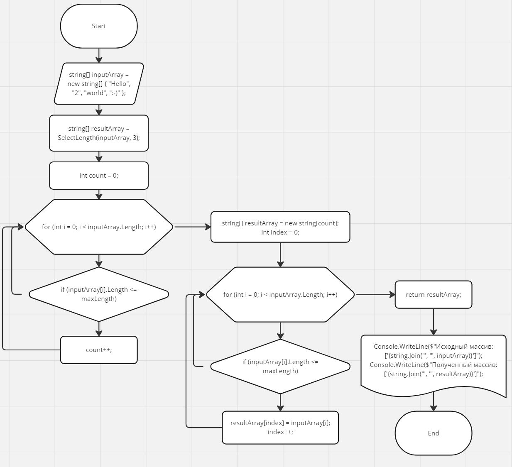

# Control-work-on-the-main-block

Контрольная работа

Задача алгоритмически не самая сложная, однако для полноценного выполнения проверочной работы необходимо:
1. Создать репозиторий на GitHub
2. Нарисовать блок-схему алгоритма (можно обойтись блок-схемой основной содержательной части, если вы выделяете её в отдельный метод)
3. Снабдить репозиторий оформленным текстовым описанием решения (файл README.md)
4. Написать программу, решающую поставленную задачу
5. Использовать контроль версий в работе над этим небольшим проектом (не должно быть так, что всё залито одним коммитом, как минимум этапы 2, 3, и 4 должны быть расположены в разных коммитах)

**Задача:** _Написать программу, которая из имеющегося массива строк формирует новый массив из строк, длина которых меньше, либо равна 3 символам. Первоначальный массив можно ввести с клавиатуры, либо задать на старте выполнения алгоритма. При решении не рекомендуется пользоваться коллекциями, лучше обойтись исключительно массивами._

**Описание решения**

Метод "_SelectLength_" принимает массив из строк - "_inputArray_".
Переменной "_maxLength_" задаем максимальную длину искомых строк в массиве. Далее проходим циклом для определения количества подходящих элементов для формирования итогового массива. 
Создаем новый массив строк "_resultArray_" с количеством элементов, которое определили ранее.
Копируем подходящие по условию элементы в новый массив так же с помощью цикла.
Результат - вывод исходного и полученного массивов.

